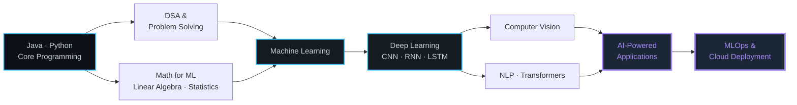

<div align="center">


<br/>

<a href="https://github.com/mayanksinghgitu"></a>
<a href="https://www.linkedin.com/in/mayank-singh-58a7a228b"></a>
<a href="mailto:mayanksinghsara80@gmail.com"></a>
<!-- TODO: add your LeetCode profile URL below, then uncomment -->
<!-- <a href="https://leetcode.com/u/YOUR-USERNAME/"></a> -->
<!-- TODO: add your portfolio URL below, then uncomment -->
<!-- <a href="https://YOUR-PORTFOLIO-URL"></a> -->

<br/><br/>


<br/><br/>

<a href="#about"></a>
<a href="#stack"></a>
<a href="#analytics"></a>
<a href="#projects"></a>
<a href="#dsa"></a>
<a href="#experience"></a>
<a href="#connect"></a>

</div>

---

<a id="about"></a>

## About

Computer Science undergraduate specialising in **Artificial Intelligence and Machine Learning**, with Java as my core engineering language and Python as my research language. I build systems that go past the notebook — behaviour-based security models, real-time vision pipelines, and database-backed desktop applications — and I care as much about latency, schema design, and false-positive rates as I do about accuracy.

```java
public final class MayankSingh implements Engineer {

    static final String ROLE      = "AI/ML Developer · Java Engineer";
    static final String EDUCATION = "B.Tech CSE (AI & ML), Galgotias University · 2023–2027";
    static final String BASE      = "Varanasi / Greater Noida, Uttar Pradesh, India";

    String[] languages = { "Java", "Python", "SQL", "JavaScript" };
    String[] focus     = { "Deep Learning", "Computer Vision", "NLP", "AI for Security" };
    String[] learning  = { "Transformers", "GenAI", "MLOps", "Distributed Computing" };

    @Override
    public String currentlyBuilding() {
        return "Production-ready AI systems — dataset to deployment.";
    }
}
```

<table width="100%">
<tr>
<td width="50%" valign="top">

**What I work on**

- Designing and training ML / DL models end to end
- Computer-vision pipelines with OpenCV and CNNs
- Applying deep learning to cybersecurity problems
- Java desktop and backend systems on relational schemas
- Feature engineering and EDA on messy, real datasets

</td>
<td width="50%" valign="top">

**What I'm growing into**

- Transformer architectures and applied GenAI
- MLOps — versioning, tracking, monitoring, deployment
- Advanced DSA: graphs, DP, backtracking
- Distributed computing and system design
- Full-stack delivery of AI products

</td>
</tr>
</table>

---

<a id="focus"></a>

## Currently Exploring

<div align="center">


</div>

---

<a id="stack"></a>

## Tech Stack

<div align="center">

**Languages**


**AI · ML · Deep Learning**


<p>


</p>

**Java Ecosystem & Web**

<p>


</p>

**Tools, Cloud & Platforms**


<p>


</p>

**Core Computer Science**

<p>


</p>

</div>

---

<a id="analytics"></a>

## GitHub Analytics

<div align="center">


<br/><br/>


<br/><br/>


<br/><br/>


</div>

---

<a id="snake"></a>

## Contribution Graph

<div align="center">

<!-- Requires the GitHub Action described in the setup notes. Until the workflow
     has run once, these SVG files will not exist and the image will not render. -->
<picture>
  <source media="(prefers-color-scheme: dark)" srcset="https://raw.githubusercontent.com/mayanksinghgitu/mayanksinghgitu/output/snake-dark.svg" />
  <source media="(prefers-color-scheme: light)" srcset="https://raw.githubusercontent.com/mayanksinghgitu/mayanksinghgitu/output/snake.svg" />
  
</picture>

</div>

---

<a id="projects"></a>

## Featured Projects

<div align="center">

</div>

<br/>

<details open>
<summary><b>AI-Powered Ransomware Detection System</b> — <i>Deep Learning · Cybersecurity</i></summary>

<br/>

A proactive defence system that identifies ransomware by how it behaves, rather than waiting for a signature to exist.

| | |
|---|---|
| **Problem** | Signature-based tools cannot catch zero-day or polymorphic ransomware before encryption spreads |
| **Approach** | LSTM/CNN models monitor system calls and flag anomalous encryption behaviour |
| **Highlights** | Reduced false positives by 22% · automated mitigation trigger that isolates malicious processes on detection |
| **Timeline** | February 2026 |

<p>


</p>

<!-- TODO: Repository → https://github.com/mayanksinghgitu/REPO-NAME -->

</details>

<details>
<summary><b>AI-Based Emotion Detection for Mental Health</b> — <i>Computer Vision · CNN</i></summary>

<br/>

Real-time facial expression recognition built for low-power clinical monitoring devices.

| | |
|---|---|
| **Problem** | Continuous mental-health monitoring needs emotional context without heavy hardware |
| **Approach** | OpenCV face detection and preprocessing feeding a custom CNN classifier |
| **Highlights** | 91% classification accuracy on FER2013 · inference latency minimised for constrained devices |
| **Timeline** | January 2026 |

<p>


</p>

<!-- TODO: Repository → https://github.com/mayanksinghgitu/REPO-NAME -->

</details>

<details>
<summary><b>Student Performance Monitoring System</b> — <i>Java · Desktop Application</i></summary>

<br/>

A full desktop application for institutions to track marks, attendance and academic progress.

| | |
|---|---|
| **Problem** | Spreadsheet-based record keeping is slow, error-prone and hard to report on |
| **Approach** | Java Swing front end over a normalised relational MySQL schema, accessed through JDBC |
| **Highlights** | 35% improvement in SQL query performance · automated PDF report generation · visual analytics dashboards |
| **Timeline** | July 2025 |

<p>


</p>

<!-- TODO: Repository → https://github.com/mayanksinghgitu/REPO-NAME -->

</details>

<details>
<summary><b>Fake URL & Phishing Detector</b> — <i>Machine Learning · Security</i></summary>

<br/>

Classifies URLs as safe or malicious from lexical and host-based signals, with no blacklist dependency.

| | |
|---|---|
| **Problem** | Phishing domains mutate faster than blacklists can be updated |
| **Approach** | Custom feature extractor (length, entropy, special characters, domain signals) feeding supervised classifiers |
| **Highlights** | 25+ engineered URL features · model benchmarking · confusion-matrix driven tuning |
| **Timeline** | <!-- TODO: add month and year --> |

<p>


</p>

<!-- TODO: Repository → https://github.com/mayanksinghgitu/REPO-NAME -->

</details>

<details>
<summary><b>Stock Price Prediction</b> — <i>Machine Learning · Time Series</i></summary>

<br/>

Machine-learning models applied to historical market data to forecast price movement.

| | |
|---|---|
| **Problem** | <!-- TODO: describe the specific problem framing --> |
| **Approach** | <!-- TODO: models and features used --> |
| **Highlights** | <!-- TODO: evaluation metric and result --> |
| **Timeline** | <!-- TODO: add month and year --> |

<p>


</p>

<!-- TODO: Repository → https://github.com/mayanksinghgitu/REPO-NAME -->

</details>

<!-- OPTIONAL: pinned repository cards. Replace REPO-NAME and uncomment.
<div align="center">
  <a href="https://github.com/mayanksinghgitu/REPO-NAME">
    
  </a>
</div>
-->

---

<a id="dsa"></a>

## Problem Solving

<div align="center">


<br/><br/>

| Topic | Status |
|:---|:---|
| Arrays & Strings | `██████████` Comfortable |
| HashMap / HashSet | `█████████░` Comfortable |
| Stack & Queue | `█████████░` Comfortable |
| Searching & Sorting | `█████████░` Comfortable |
| Linked List | `████████░░` Comfortable |
| Recursion | `████████░░` Comfortable |
| Trees & BST | `███████░░░` In progress |
| Graphs | `██████░░░░` In progress |
| Dynamic Programming | `█████░░░░░` In progress |
| Greedy & Backtracking | `███░░░░░░░` Up next |

<sub>Bars indicate current practice focus and confidence, not a measured score.</sub>

<!-- TODO: add your LeetCode username below and uncomment for a live stats card.

-->

</div>

---

<a id="roadmap"></a>

## Learning Roadmap



**Where my time goes right now**

```text
█████████████████████░  Deep Learning & Computer Vision
███████████████████░░░  Java & DSA
█████████████████░░░░░  Machine Learning & Data Science
███████████████░░░░░░░  Transformers & GenAI
████████████░░░░░░░░░░  MLOps, Cloud & Deployment
```

<sub>These bars describe how I currently allocate my learning time, not proficiency levels.</sub>

---

<a id="experience"></a>

## Experience

| Role | Organisation | Period | Focus |
|:---|:---|:---|:---|
| **Celonis AI in Process Intelligence Intern** | EduSkills · Remote | Apr 2026 – Jun 2026 | Google Cloud Computing, AI/ML, networking and cloud security. Hands-on with Compute Engine, BigQuery, Vertex AI, Dataflow and Load Balancing. |
| **Data Science Intern** | CodSoft · Remote | Dec 2025 – Jan 2026 | Built Random Forest, Naive Bayes and XGBoost models with a 15% precision increase through rigorous EDA. Engineered Pandas/NumPy pipelines and delivered insights via Seaborn and Matplotlib. |
| **AI-ML Virtual Intern** | EduSkills · Remote | Oct 2025 – Dec 2025 | Deployed ML workflows with model versioning and tracking; built ANN/CNN models and tuned them with Scikit-Learn, TensorFlow, PyTorch and Keras for better latency and accuracy. |

---


<!-- TODO: add certificate verification links where available -->

---

<a id="connect"></a>

## Let's Connect

<div align="center">

Open to **AI/ML internships**, **open-source collaboration**, **research discussions** and **hackathon teams**.

<br/>

<a href="https://www.linkedin.com/in/mayank-singh-58a7a228b">
  
</a>
<a href="mailto:mayanksinghsara80@gmail.com">
  
</a>
<a href="https://github.com/mayanksinghgitu">
  
</a>
<!-- TODO: add LeetCode, Portfolio and Instagram links here when available -->

</div>

---

<div align="center">

### Turning ideas into intelligent systems.

If a project here is useful to you, a star genuinely helps.


</div>
