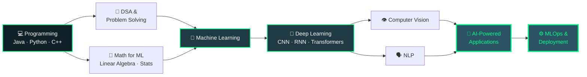

<!-- ═══════════════════════════════════ HEADER ═══════════════════════════════════ -->

<div align="center">


<br/>

<a href="https://github.com/mayanksinghgitu">
  
</a>
<a href="https://github.com/mayanksinghgitu?tab=followers">
  
</a>
<a href="https://github.com/mayanksinghgitu?tab=repositories">
  
</a>


</div>

---

<!-- ═══════════════════════════════════ ABOUT ═══════════════════════════════════ -->

## 🧑‍💻 About Me

> Turning data into decisions and ideas into shippable software.

```python
class MayankSingh:
    def __init__(self):
        self.role        = "AI/ML Developer & Java Developer"
        self.education   = "B.Tech — Computer Science (AI & ML)"
        self.languages   = ["Python", "Java", "C++", "SQL"]
        self.focus       = ["Deep Learning", "Computer Vision", "AI Security"]
        self.currently   = "Building production-ready AI applications"
        self.learning    = ["Transformers", "MLOps", "System Design"]
        self.fun_fact    = "I debug models the same way I debug code — one layer at a time."

    def say_hi(self):
        print("Thanks for stopping by! Let's build something intelligent. 🚀")


me = MayankSingh()
me.say_hi()
```

<table>
<tr>
<td width="50%" valign="top">

**🎯 What I Do**
- 🤖 Design & train ML / DL models end-to-end
- 👁️ Build computer-vision pipelines with OpenCV + CNNs
- ☕ Develop Java desktop & backend applications
- 🛡️ Explore AI applied to cybersecurity problems
- 📊 Turn raw datasets into clean, usable features

</td>
<td width="50%" valign="top">

**🌱 What I'm Growing Into**
- 🔭 Advanced Deep Learning architectures
- 🧠 Transformers, attention & sequence models
- ⚙️ MLOps — deployment, monitoring, versioning
- 🧩 Data Structures & Algorithms mastery
- 🌐 Full-stack delivery of AI products

</td>
</tr>
</table>

---

<!-- ═══════════════════════════════════ TECH STACK ═══════════════════════════════════ -->

## 🛠️ Tech Arsenal

<div align="center">

### 💻 Languages


### 🤖 AI / ML / Data


<p>


</p>

### ☕ Java Ecosystem
<p>


</p>

### 🧰 Tools & Platforms


</div>

---

<!-- ═══════════════════════════════════ PROJECTS ═══════════════════════════════════ -->

## 🚀 Featured Projects

<div align="center">

</div>

<br/>

<details open>
<summary><b>🛡️ AI-Powered Ransomware Detection System</b> — <i>Deep Learning · Cybersecurity</i></summary>

<br/>

A behaviour-based detection engine that flags ransomware activity before encryption spreads, instead of relying on signature matching.

| | |
|---|---|
| **Problem** | Signature-based antivirus fails against zero-day and polymorphic ransomware |
| **Approach** | Extract behavioural features (file ops, entropy, API calls) → train DL + classical ML ensemble |
| **Highlights** | Feature engineering pipeline · model comparison (RF / SVM / Neural Net) · evaluation with precision-recall focus |
| **Outcome** | Early-warning classification of ransomware-like behaviour patterns |

<p>


</p>

</details>

<details>
<summary><b>😊 Emotion Detection System</b> — <i>Computer Vision · CNN</i></summary>

<br/>

Real-time facial emotion recognition that reads expressions straight from a webcam feed.

| | |
|---|---|
| **Problem** | Machines need emotional context to make human interaction feel natural |
| **Approach** | Haar-cascade / DNN face detection → preprocessing → custom CNN classifier |
| **Highlights** | Live video inference · data augmentation · multi-class emotion output with confidence scores |
| **Outcome** | Working real-time emotion classifier on live camera input |

<p>


</p>

</details>

<details>
<summary><b>🎓 Student Performance Monitoring System</b> — <i>Java · Desktop Application</i></summary>

<br/>

A full desktop application for institutions to track marks, attendance and academic progress.

| | |
|---|---|
| **Problem** | Manual record-keeping is slow, error-prone and hard to report on |
| **Approach** | Java Swing UI + MySQL backend via JDBC, with iText-generated PDF reports |
| **Highlights** | CRUD on students & records · attendance tracking · exportable performance reports · role-based access |
| **Outcome** | Deployable desktop tool replacing spreadsheet-based workflows |

<p>


</p>

</details>

<details>
<summary><b>🕵️ Fake URL & Phishing Detector</b> — <i>Machine Learning · Security</i></summary>

<br/>

Classifies URLs as safe or malicious using lexical and host-based features — no blacklist required.

| | |
|---|---|
| **Problem** | Phishing URLs mutate faster than blacklists can be updated |
| **Approach** | Engineer 25+ URL features (length, entropy, special chars, domain age signals) → supervised classification |
| **Highlights** | Custom feature extractor · model benchmarking · confusion-matrix driven tuning |
| **Outcome** | Lightweight detector that generalises to unseen phishing URLs |

<p>


</p>

</details>

<!--
  ⚡ OPTIONAL: live pinned-repo cards.
  Uncomment and replace REPO-NAME with your actual repository names.

<div align="center">
  <a href="https://github.com/mayanksinghgitu/REPO-NAME">
    
  </a>
  <a href="https://github.com/mayanksinghgitu/REPO-NAME">
    
  </a>
</div>
-->

---

<!-- ═══════════════════════════════════ GITHUB STATS ═══════════════════════════════════ -->

## 📊 GitHub Analytics

<div align="center">


<br/><br/>


<br/><br/>


<br/>

### 🏆 GitHub Trophies


</div>

---

<!-- ═══════════════════════════════════ SNAKE ═══════════════════════════════════ -->

## 🐍 Contribution Snake

<div align="center">

<picture>
  <source media="(prefers-color-scheme: dark)" srcset="https://raw.githubusercontent.com/mayanksinghgitu/mayanksinghgitu/output/snake-dark.svg" />
  <source media="(prefers-color-scheme: light)" srcset="https://raw.githubusercontent.com/mayanksinghgitu/mayanksinghgitu/output/snake.svg" />
  
</picture>

</div>

---

<!-- ═══════════════════════════════════ ROADMAP ═══════════════════════════════════ -->

## 🧠 Learning Roadmap



---

<!-- ═══════════════════════════════════ DSA ═══════════════════════════════════ -->

## 💻 DSA & Competitive Programming

<div align="center">

| Topic | Status | Progress |
|:---|:---:|:---|
| 🔢 Arrays & Strings | ✅ Comfortable | `██████████` |
| 🗂️ HashMap / HashSet | ✅ Comfortable | `█████████░` |
| 📚 Stack & Queue | ✅ Comfortable | `█████████░` |
| 🔗 Linked List | ✅ Comfortable | `████████░░` |
| 🔍 Searching & Sorting | ✅ Comfortable | `█████████░` |
| 🌳 Trees & BST | 🔄 In Progress | `███████░░░` |
| 🕸️ Graphs | 🔄 In Progress | `██████░░░░` |
| 🧮 Dynamic Programming | 🔄 In Progress | `█████░░░░░` |
| 🎯 Greedy & Backtracking | 📅 Up Next | `███░░░░░░░` |

</div>

<!--
  ⚡ OPTIONAL: live LeetCode card — replace YOUR-LEETCODE-USERNAME
<div align="center">
  
</div>
-->

---

<!-- ═══════════════════════════════════ QUOTE ═══════════════════════════════════ -->

<div align="center">

### 💭 Dev Quote of the Day


</div>

---

<!-- ═══════════════════════════════════ CONNECT ═══════════════════════════════════ -->

## 🌐 Let's Connect

<div align="center">

<a href="https://github.com/mayanksinghgitu">
  
</a>
<a href="https://www.linkedin.com/in/mayank-singh-58a7a228b">
  
</a>
<a href="mailto:your.email@example.com">
  
</a>
<a href="#">
  
</a>

<br/><br/>

💡 **Open to:** AI/ML internships · open-source collaboration · research discussions · hackathon teams

</div>

---

<!-- ═══════════════════════════════════ FOOTER ═══════════════════════════════════ -->

<div align="center">


### 💚 Code. Learn. Build. Repeat.

⭐ **If you find my work interesting, consider starring a repo — it genuinely helps!**


</div>
